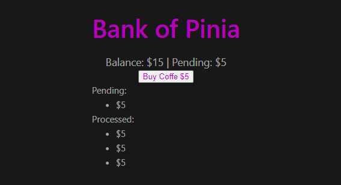

# learn-pinia

```
Just trying to grasp pinia and some typescript along the run :)
Sorry for the poor CSS, it's been a long and tiring afternoon, I'll move along instead of fixing it since I think it's enough for what this little project has to offer
````


## Project Setup

```
npm install
```

### Compile and Hot-Reload for Development

```
npm run dev
```

### Type-Check, Compile and Minify for Production

```
npm run build
```
